# Challenge
In this project, I build a convolutional neural network based on residual neural network 18 from scratch, and applied several methods including data augmentation, regularization, feature selection and transfer learning to test on models and improve the performance. Finally, I choose to use ResNet18, Epoch=56, trained on augmented data, regularization, and transfer learning. The maximum validation AUROC is 0.9826, greatest testing AUROC is 0.9917
## Model Evaluation
Since this challenge part only grades AUROC score of our predicted model, I choose AUROC as a main criteria of model evaluation. But it does not mean I do not see loss and accuracy in the whole process. In the later part, whenever there is a experiment on certain methods, I will show the result by presenting an image comprised of three criteria: accuracy, loss and AUROC, and report the maximum AUROC score explicitly.

## Model architecture
From the slides, it's shown that ResNet achieved best performance in 2014 ImageNet Challenge. Therefore, I think this is a good model for me to reference.

In the `challenge.py`, I implemented a model based on ResNet architecture. It has 18 layers in total, while each layer was normally distributed with $\mu=0.0$, $\sigma=\frac{1}{\sqrt{5\times 5\times num\_input\_channels}}$.

In the transition of convolutional layers and linear layers, I used an average pooling layer. This can let me avoid calculating the image dimension changes in convolutional layers.

The following image shows the result of my first training and validation.
- Criterion: cross entropy loss
- Optimizer: adam
- Learning rate: 0.001
- Patience: 5
- Batch size: 32

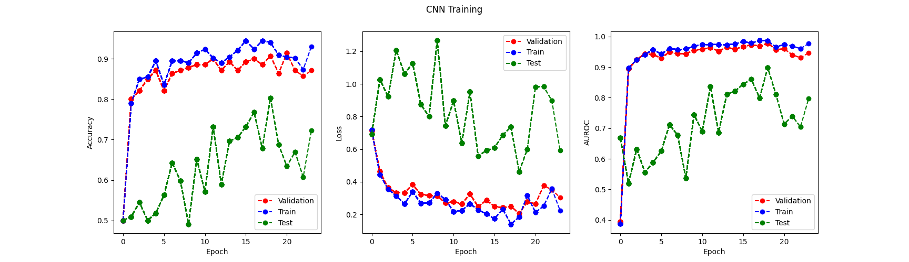

From the figure, we know that 
- the greatest validation AUROC is 0.9535, epoch 7
- the lowest validation error is 0.3132, epoch 2
This is not a good result, so we need to make more improvements.

For comparison, I also implemented the original model that we used in the previous part.
The result is as follows:
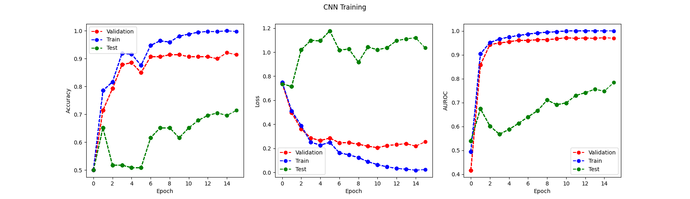


We can figure out that the ResNet18 has better performance, but it needs a lot of time to train. In the later sections, I will focus on the original model, but when some methods has improvements, I will apply them into resNet.
## Regularization (Weight decay, dropout, etc.)
In this section, I will apply some regularization methods. Regularization can be known as a way to adding additional constraints to the optimization problem in order to prevent overfitting. From the above raw test, we can intuitively sense that the model receives lots of noises in the process, and the model overfit when epoch is very big. So, it's reasonable to apply regularization in mitigate the effect of overfitting.

### Dropout
First, we can employ dropout. I first by applying each dropout after each convolutional layers.

And the result is as follows:

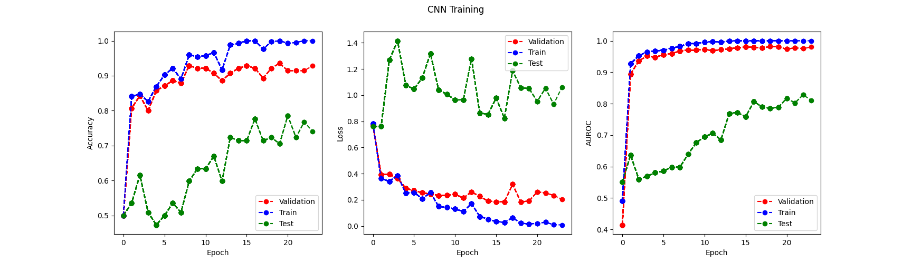

The maximum AUROC is 0.8281, this is not a good performance, so we need to continue improve it.

However, since our original model has better performance than the most original model. we will keep this methods.
### Weight Decay

As shown in the following code, we can add weight decay to mitigate the effect of overfitting.

```Python
optimizer = torch.optim.Adam(model.parameters(), lr=1e-3, weight_decay=0.01)
```

This principle behind it is quite like what we use L2 norm regularization in support vector machine, and the value we input means the importance of this L2 norm.

After applying this method, we can get the following result.

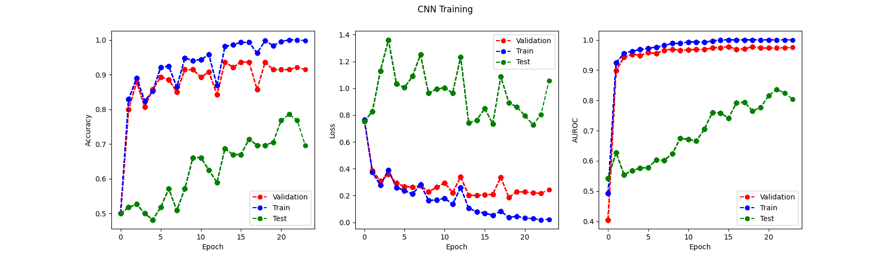

The maximum test AUROC is 0.8361, which is better than last trial. So I decide to keep it.

### Batch Normalization
Given the improvements brought by the above two methods, we are sure that regularization can indeed help the model to increase performance.

So, now I decided to apply batchNormal to this model. Batch Normalization normalizes the inputs of each layer in a mini-batch, which helps stabilize and speed up the training process. Here's the performance after I implement the Batch Normalization to the model.


The maximum AUROC is 0.9021! It's a great improvement!

After implementing dropout, weight decay and batch normalization, the final code is shown as below.
```Python
    def __init__(self):
        super().__init__()
        self.conv1 = nn.Conv2d(3, 16, kernel_size=(5,5), stride=(2,2), padding=2)
        self.bn1 = nn.BatchNorm2d(16) 
        self.conv2 = nn.Conv2d(16, 64, kernel_size=(5,5), stride=(2,2), padding=2)
        self.bn2 = nn.BatchNorm2d(64)  
        self.conv3 = nn.Conv2d(64, 8, kernel_size=(5,5), stride=(2,2), padding=2)
        self.bn3 = nn.BatchNorm2d(8)   
        self.dropout1 = nn.Dropout(p=0.1)
        self.dropout2 = nn.Dropout(p=0.2)
        self.dropout3 = nn.Dropout(p=0.3)
        self.pool = nn.MaxPool2d(kernel_size=(2,2), stride=(2,2))
        self.fc1 = nn.Linear(32, 2)
        self.init_weights()
    def forward(self, x):
        N, C, H, W = x.shape

        x = F.relu(self.bn1(self.conv1(x)))
        x = self.dropout1(x)
        x = self.pool(x)
        x = F.relu(self.bn2(self.conv2(x)))
        x = self.dropout2(x)
        x = self.pool(x)
        x = F.relu(self.bn3(self.conv3(x)))
        x = x.reshape(N, 32)
        x = self.fc1(x)
        
        return x
```

And we can apply some similar strategies to ResNet18 model.


## Transfer Learning
The transfer learning is a good way to let our current model receive more information. Since our original dataset has 8 classes in total, we can train the model on 8 classes first, then transfer the learned parameters and freeze them when training new models on dataset of 2 classes. In this way, we can take advantages of the previous trained model and get better performance.

Since we've already known the power of transfer learning in previous problems, in this part, I will only apply the code on the ResNet18 model.

From section 1, I've already presented my handwritten code of ResNet18. In order to do transfer learning on this model, I need to set the `num_classes` equal to 8 first, and then store the code into `p2/model/challenge_source.py`. And I also add `train_challenge_source.py` to train `challenge_source.py` directly. Finally, in the `train_challenge.py`, I add an `if` statement, asking if user would like to use transfer learning:
```Python
do_transfer_learning = input("use transfer learning?y/n\n")
```
If the user replies `y`, then this function will direct to transfer learning part, which has the code as follows:
```Python
        freeze_none = getResNet18_source()
        print("Loading source ...")
        freeze_none, _, _ = restore_checkpoint(
            freeze_none, config("challenge_source.checkpoint"), force=True, pretrain=True
        )
        
        
        freeze_whole = copy.deepcopy(freeze_none)
        freeze_layers(freeze_whole, 10)
        
        # modify the last layer:
        num_class = 2
        freeze_none.fc = torch.nn.Linear(freeze_none.fc.in_features, num_class)
        freeze_whole.fc = torch.nn.Linear(freeze_whole.fc.in_features, num_class)

        
        train(tr_loader, va_loader, te_loader, freeze_none, "./checkpoints/challenge_target0/", 0)
        train(tr_loader, va_loader, te_loader, freeze_whole, "./checkpoints/challenge_target1/", 1)
```

Now, I'd like to briefly discuss the meaning of the above code.
- In `restore_checkpoint`, we can restore the checkpoint we learned from `train_challenge_source.py`.
- In `freeze_layers` function, we can specify how many layers to freeze.
- In `freeze_whole.fc = torch.nn.Linear(freeze_whole.fc.in_features, num_class)`, we modify the final layer (the linear layer) to have the output of 2 since we have 2 classes.

After training all the above steps, we can get the following results:

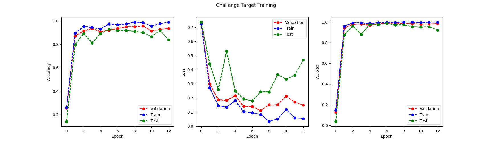


The maximum AUROC is 0.994 and 0,9917, respectively. This is a huge improvement!!!

## Data Augment
like what we have done in previous part, we can apply data augmentation to our dataset so that our model can receive more information.

In this section, I decided to use `torchvision.transform`. The following are code implementations.
### Rotate
Instead of using fixed rotation like what we have done in previous part, I used random rotation so that the image can be more representative. 

```Python
random_rotation = transforms.RandomRotation(degrees=(-20, 20))
```
### Clip, Flip
Clipping and flipping should not change the types of images, this is one of the most popular data augmentation methods.
```Python
randomVerticalFlip = transforms.RandomVerticalFlip()
random_horizontal_flip = transforms.RandomHorizontalFlip()
random_resized_crop = transforms.RandomResizedCrop(
    (64, 64), scale=(0.1, 1), resized=(0.5, 2))
```
### color changing
We can also change the color of the images. It contain 4 aspects: Brightness, Contrast, Saturation and Hue.
```Python
torchvision.transforms.ColorJitter(
    brightness=0.5, contrast=0.5, saturation=0.5, hue=0.5
)
```
Finally, we can add all of the above codes together. The final code is like this:

```Python
transform_shape = tortransforms.Compose([
    tortransformers.RandomRotation(degrees=(-20, 20)),
    tortransforms.RandomResizedCrop(
        (64, 64), scale=(0.3, 1), retio=(0.5, 2)),
    tortransforms.RandomHorizontalFlip(),
    tortransforms.ToTensor(),
])

transformer_color = tortransformers.ColorJitter(
  brightnenss=0.5, contrast=0.5, saturation=0.5, hue=0.5
)
```

Due to the time limit, I will only test this method on our base model.

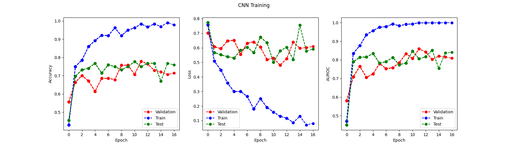

It turns out that the performance of the model does not have much improvement. But it's still worth a try.

## Feature Selection
In this section, I want to use feature selection to highlight some features in the image so that our model can pay more attention to them. I decided to use edge detection. It's an important feature in image because it tells the shape of a building and is always the boundary of this building. With the help of this, we can eliminate the effect of noisy in the image and make our model concentrate on the shape of a building.

Given that the sky is usually white and the building is usually black (gray) in image, I decide to add gray color to the detected edge.

The code is as follows:
```Python
import cv2
import glob

dataset_dir = "data/image_backup"

image_file_paths = []

for file_path in glob.glob(dataset_dir + "/*.png"):
    image_file_paths.append(file_path)

for image_file_path in image_file_paths:

    image = cv2.imread(image_file_path)
    gray_image = cv2.cvtColor(image, cv2.COLOR_BGR2GRAY)
    ret, thresh = cv2.threshold(gray_image, 150, 255, cv2.THRESH_BINARY)
    contours, _ = cv2.findContours(thresh, cv2.RETR_TREE, cv2.CHAIN_APPROX_SIMPLE)
    cv2.drawContours(image, contours, -1, (128, 128, 128), 1)
    cv2.imwrite(image_file_path, image)
```

In the above code, I employ some functions in opencv to help me detect the edge of some images. When the edges of a image is detected, the program will add a gray contour of 1 pixel size to it. This actually serves as a way to highlight these features.

One example is like this:

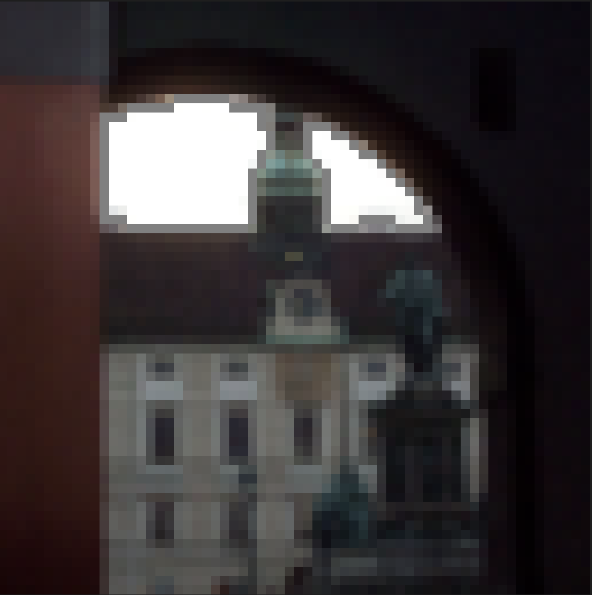
From the image, we can notice that the building and window has gray edges around it.

But sometimes, this implementation may not be a good idea, because this edge detection method sometime has errors.

For example, we can see this picture:

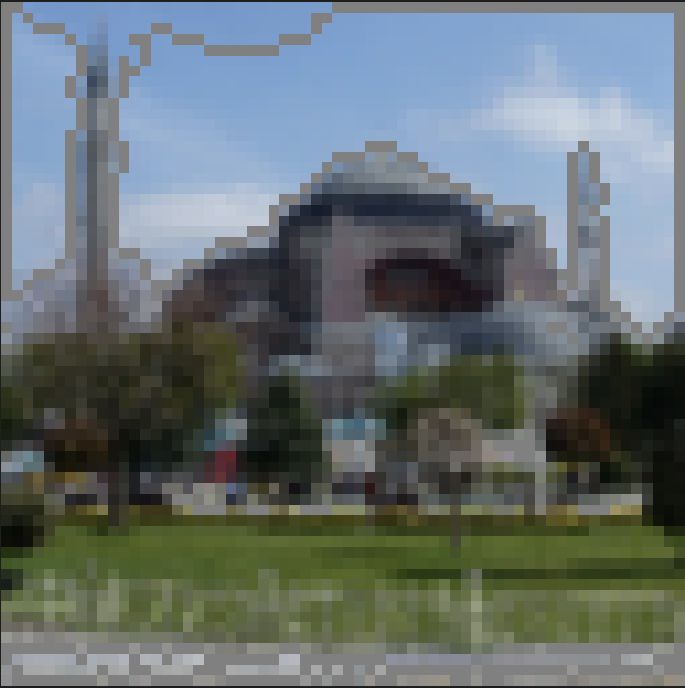

The sky has some gray line, which is an error that shouldn't happen.

The code is as follows:
```Python
import cv2
import glob

dataset_dir = "data/image_backup"

image_file_paths = []

for file_path in glob.glob(dataset_dir + "/*.png"):
    image_file_paths.append(file_path)

for image_file_path in image_file_paths:

    image = cv2.imread(image_file_path)
    gray_image = cv2.cvtColor(image, cv2.COLOR_BGR2GRAY)
    ret, thresh = cv2.threshold(gray_image, 150, 255, cv2.THRESH_BINARY)
    contours, _ = cv2.findContours(thresh, cv2.RETR_TREE, cv2.CHAIN_APPROX_SIMPLE)
    cv2.drawContours(image, contours, -1, (128, 128, 128), 1)
    cv2.imwrite(image_file_path, image)

```

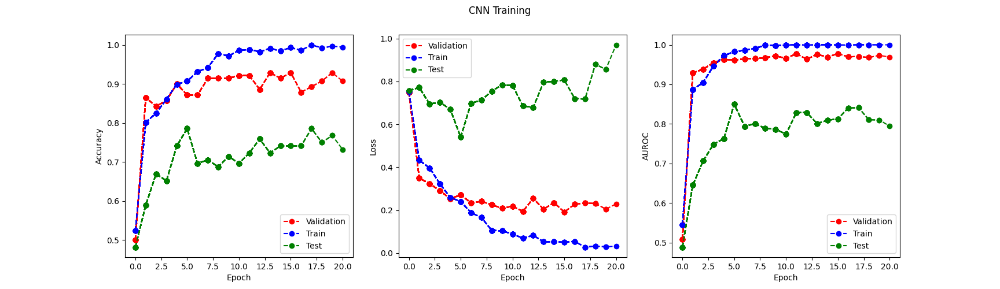

The maximum AUROC is 0.8406. It's a good number. But given the deviation in prediction, I think this method may introduce too much noise into the dataset.

## Conclusion
Based on the above analysis, I'd like to apply data augmentation, transfer learning and regularization to my handwritten resnet18.

The source training result is:

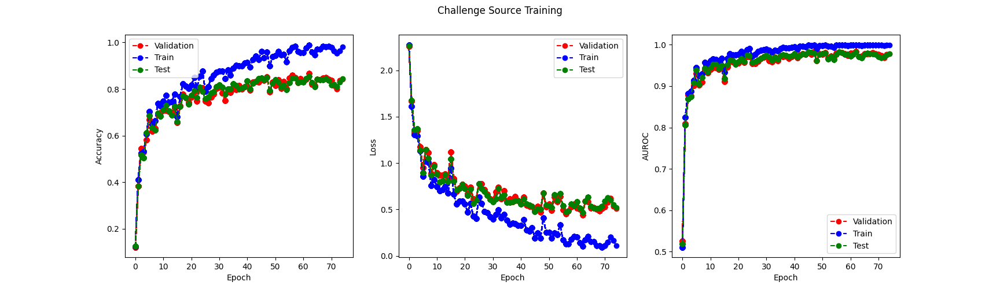
The maximum epoch is 56: 0.9826

The final performance of my target model is:
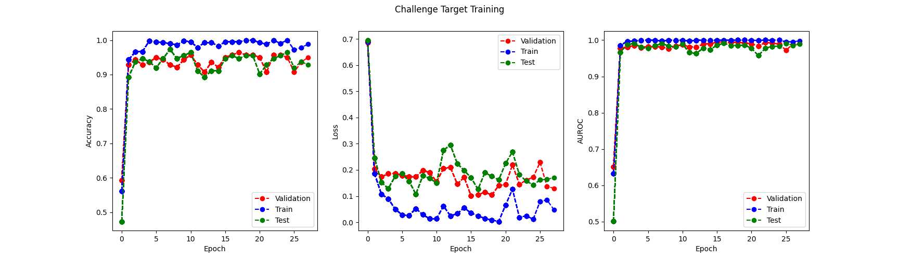
The best AUROC score is: 0.9917

